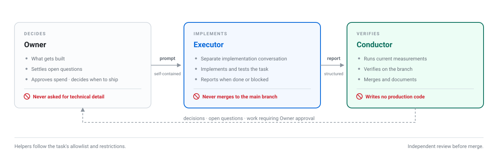
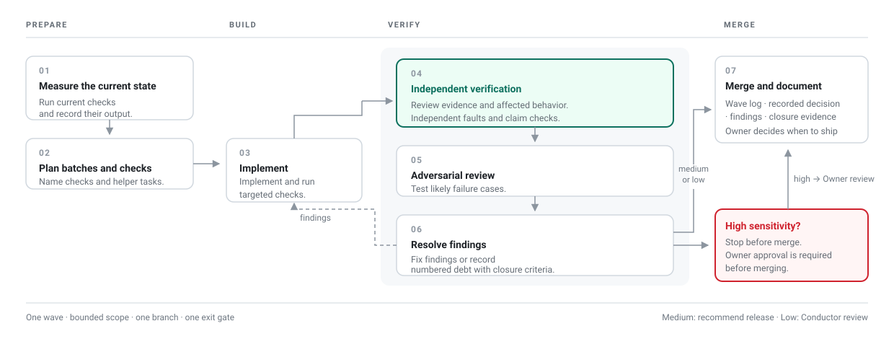
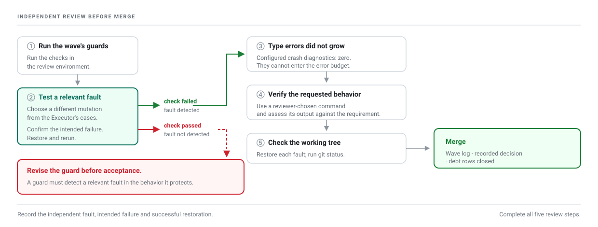

<div align="center">


### An engineering operating model for building with AI agents

**Build with AI. Verify before acceptance.**

[](LICENSE-DOC)
[](LICENSE)
[](docs/README.md)

[**Start here**](docs/00-foreword.md) · [**Get started**](#get-started) · [**Documentation**](docs/README.md) · [**Terms**](docs/00-terms.md) · [**Toolkit**](scripts/README.md) · [**Language support**](scripts/LANGUAGES.md)

</div>

Mawja is an engineering operating model for building software with AI agents. It helps project owners, including those who do not write code, assess the quality of delivered software before accepting it. Documented checks and independent technical review provide evidence of what works, what has been tested and what needs follow-up.

Developers use the same framework to structure planning, implementation, testing and documentation.

## Goals

- **Clear requirements:** Define the expected behavior and [acceptance criteria](docs/00-terms.md#acceptance-criteria) before implementation.
- **Structured work:** Organize tasks, [prompts](docs/05-the-wave-prompt.md), project files and decisions.
- **Independent verification:** Check required behavior and [review the implementation independently](docs/09-the-verification-protocol.md).
- **Continuity:** Preserve [decisions and evidence](docs/06-file-architecture.md) so work can continue across conversations and agents.
- **Clear delivery:** [Distinguish completed work, verified results and remaining limitations](docs/02-the-three-roles.md#review-the-delivery).

## What's included

- A workflow with separate responsibilities for the Owner, implementer and reviewer.
- Tools that generate task prompts from repository measurements and verify implementation branches.
- Runnable TypeScript, JavaScript and Python examples with application code, tests and configuration.
- Procedures for debt tracking, mutation testing and working across agent tools.

You can also use Mawja's workflow with other programming languages. See [how to adapt the tools to your project](scripts/LANGUAGES.md#additional-languages).

[Start here](docs/00-foreword.md) explains the Owner's responsibilities and guides you through understanding the workflow, running an example, or adopting Mawja in your project.

## Get started

Choose TypeScript, JavaScript or Python for the example application. All examples require Git, Node.js and npm. Python also requires Python 3.10 or later and pip. See the [tested versions and requirements](scripts/LANGUAGES.md#compatibility).

Clone Mawja and open its directory:

<!-- run:clone -->
```bash
git clone https://github.com/EngBanan/mawja-operating-model.git
cd mawja-operating-model
```

Run **one** of the following setup blocks from the Mawja directory. Each creates a separate project beside it. The destination directory must not already exist or be inside another Git repository.

### TypeScript

<!-- run:create-typescript -->
```bash
node examples/create.mjs typescript ../mawja-typescript
cd ../mawja-typescript
git init -b main
npm ci
npm run types:init
npm run check
```

### JavaScript

<!-- run:create-javascript -->
```bash
node examples/create.mjs javascript ../mawja-javascript
cd ../mawja-javascript
git init -b main
npm ci
npm run types:init
npm run check
```

### Python

<!-- run:create-python -->
```bash
node examples/create.mjs python ../mawja-python
cd ../mawja-python
git init -b main
python3 -m venv .venv
. .venv/bin/activate
python -m pip install -r requirements-dev.txt
npm ci
npm run types:init
npm run check
```

Keep the virtual environment active when running the Python project commands. If environment creation fails, see [Python setup troubleshooting](scripts/TROUBLESHOOTING.md#python-or-mypy-is-unavailable).

Expected: the type checker reports zero errors, and the behavior tests and debt-ledger check pass.

Next, complete a task with the [TypeScript/JavaScript walkthrough](docs/tutorials/typescript-javascript.md#save-the-initial-project) or [Python walkthrough](docs/tutorials/python.md#save-the-initial-project). To use Mawja in an existing project, follow [toolkit installation](scripts/README.md#installation).

The application and tests use the language you selected. Mawja's shared tools run on Node.js with tsx, so Python projects also need Node.js and npm.

## How the workflow works

The **Owner** sets priorities and approves release. The **Executor** implements on a branch. The **Conductor** reviews the branch, runs independent checks and merges verified work.



A [**wave**](docs/00-terms.md#wave) is one bounded task. It begins with current measurements and ends with a verified result and recorded limitations.



Implementation checks and independent review are separate steps. The reviewer runs the checks on the branch, introduces a different deliberate fault, verifies the task's central claim and confirms restoration.



Passing checks establish only the behavior they cover. [Verification](docs/09-the-verification-protocol.md) includes testing the checks themselves; [limitations](docs/12-transparency.md) describes what remains outside the workflow.

## Toolkit

| Command | Purpose |
|---|---|
| `wave:new` | Generate a task prompt with current Git, type, guard and debt measurements |
| `wave:check` | Check prompt completeness and measurement drift |
| `wave:verify` | Verify Git state, type budgets, added or changed guard commands and a supplied claim |
| `types:check` | Enforce configured crash diagnostics, per-file budgets and the total ceiling |
| `lint:debt-ledger:strict` | Validate debt identifiers and closure markers |
| `gates:count` | Count registered guard commands |
| `checks:run` | Run explicit local checks with [optional verified-result reuse](scripts/CHECK_REUSE.md) |

The examples register these commands. The [toolkit guide](scripts/README.md) explains installation, configuration and updates. Tools run inside each adopting repository; source updates are applied explicitly to project copies.

## Repository layout

| Location | Contents |
|---|---|
| [docs/](docs/README.md) | Workflow concepts, roles and verification requirements |
| [docs/tutorials/](docs/tutorials/README.md) | Step-by-step tutorials using runnable projects |
| [docs/workflow-example/](docs/workflow-example/README.md) | A sample prompt, report and review for a fictional task |
| [examples/](examples/README.md) | Application templates, tests and the project creator |
| [scripts/](scripts/README.md) | Toolkit source, installation and configuration guides |
| [tests/](tests/README.md) | Tests for the toolkit itself |
| [assets/](assets/) | Diagrams and artwork |

## Documentation

- [Documentation index](docs/README.md): roles, workflow, task prompts and technical contracts.
- [Adoption checklist](docs/13-audit-your-structure.md): assess an existing repository.
- [Worked example](docs/workflow-example/README.md): a task prompt, implementation report and review for an example notes app.
- [Multi-tool governance](AGENT_GOVERNANCE_KIT.md): shared rules, knowledge, attribution and handover.
- [References](docs/references.md): related projects and engineering concepts.

The workflow is designed for an individual working with agents. Teams can adapt it to their existing review and release processes. Its role names and conventions are Mawja-specific; the underlying testing and version-control practices are established engineering techniques.

## License

- **The document and artwork** (`docs/`, `README.md`, `AGENT_GOVERNANCE_KIT.md`, `LICENSE-DOC` and `assets/`): [CC BY 4.0](LICENSE-DOC). Share and adapt them, including commercially, with credit.
- **All other Mawja files**, including the toolkit, examples, tests and repository configuration: [MIT](LICENSE). Retain the copyright and permission notice when copying or distributing them.

Generated examples include the MIT license. Third-party dependencies retain their own licenses. For the name and logo, see [name and logo terms](LICENSE-DOC).

To cite: Abu Zahar, Banan. *"Mawja: An Engineering Operating Model."* First edition, 2026.

**[Banan Abu Zahar](https://linkedin.com/in/eng-banan)** · Riyadh · [About the author](docs/references.md#about-the-author)
