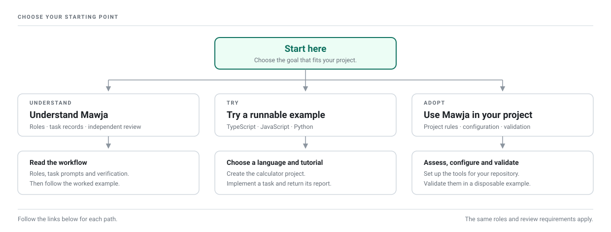

# Start here

Mawja helps you plan, implement and independently review work with AI agents. Use this guide to choose a starting point and find the next step.

[Documentation index](README.md) · [Terms](00-terms.md) · [Main README](../README.md)

## Choose a starting point

| Your goal | Start with | What you will have |
|---|---|---|
| Understand the approach | [Read the workflow](#understand-the-workflow) | A clear view of responsibilities, task records and review |
| Try the tools | [Run an example](#run-an-example) | A calculator change with checks and an implementation report |
| Apply Mawja to existing work | [Adopt the workflow](#adopt-the-workflow) | Project-specific rules, configured tools and a validated setup |

## For project owners

You can use Mawja whether or not you write code. As the [Owner](00-terms.md#owner), you define the need, resolve product decisions, help assess the result against agreed [acceptance criteria](00-terms.md#acceptance-criteria) and decide when to ship.

The [Executor](00-terms.md#executor) implements and tests the change. The [Conductor](00-terms.md#conductor) prepares the task and verifies the branch independently. Both use separate conversations. Technical investigation and verification remain required for every task, including work led by an Owner who does not read code.

An Owner with programming experience can also inspect the implementation. That inspection complements the Conductor's review. See [role responsibilities](02-the-three-roles.md) and [technical-review limits](12-transparency.md#technical-review).

## What you need to understand

Learn these practices as you work through the guide:

| Practice | What to be able to do | Read next |
|---|---|---|
| Requirements | Describe the intended result and how you will recognize it | [Acceptance criteria](00-terms.md#acceptance-criteria) |
| Project records | Find the authoritative rules, decisions, known debt and evidence | [File architecture](06-file-architecture.md) |
| Task instructions | Confirm that the goal, scope, constraints and expected report match your request | [Task prompt](05-the-wave-prompt.md) |
| Checks | Understand a test's input, expected result, actual result and limits | [Verification](09-the-verification-protocol.md) |
| Delivery | Distinguish completed work, verified behavior and unresolved findings | [Reading the report](02-the-three-roles.md#review-the-delivery) |

Ask the Conductor to explain unfamiliar measurements and propose observable acceptance criteria. Confirm that those criteria express your intended behavior before implementation. The [terms guide](00-terms.md) explains the testing vocabulary used in reports.

## Understand the workflow

1. Read [Terms](00-terms.md), then follow **Next** through the numbered chapters. Use **Previous** or **Documentation index** to revisit a topic.
2. Start with [roles](02-the-three-roles.md), [the task cycle](04-the-wave-cycle.md), [task prompts](05-the-wave-prompt.md) and [verification](09-the-verification-protocol.md) if you need an overview before the full reading.
3. Read the [worked example](workflow-example/README.md) in order: task prompt, implementation report, independent verification. It uses a fictional notes app to show the documents and evidence.

Continue with a runnable example when you want to execute the tools.

## Run an example

Follow [Get started in the main README](../README.md#get-started) to clone Mawja, choose one language and create a standalone calculator project. All three examples need Git, Node.js and npm; Python also needs its Python environment. See [language requirements](../scripts/LANGUAGES.md#compatibility).

After setup passes, continue directly with saving the project:

| Language | Project files | Next tutorial step |
|---|---|---|
| TypeScript | [TypeScript example](../examples/typescript/README.md) | [Save the initial project](tutorials/typescript-javascript.md#save-the-initial-project) |
| JavaScript | [JavaScript example](../examples/javascript/README.md) | [Save the initial project](tutorials/typescript-javascript.md#save-the-initial-project) |
| Python | [Python example](../examples/python/README.md) | [Save the initial project](tutorials/python.md#save-the-initial-project) |

The tutorial takes you through preparing a subtraction task, implementing it on a branch and checking the result. It ends before merge. Return the report and evidence for independent review. For setup errors, use [troubleshooting](../scripts/TROUBLESHOOTING.md).

## Adopt the workflow

1. Use the [adoption checklist](13-audit-your-structure.md) to inspect the project's current rules and checks.
2. Establish [project records](06-file-architecture.md) and [debt tracking](07-the-debt-ledger.md) using the repository's conventions.
3. Follow [toolkit installation](../scripts/README.md#installation), then set the project's paths and commands using [configuration](../scripts/CONFIGURATION.md) and the [technical contracts](appendix.md).
4. Exercise [integration validation](../scripts/VALIDATION.md) in a disposable example project. Record the tested setup and limits before relying on the integration.
5. Prepare a bounded task using the [task-prompt guide](05-the-wave-prompt.md).

For work across multiple agent tools, read the Mawja documentation in full, then apply [multi-tool governance](../AGENT_GOVERNANCE_KIT.md). Tools run in the adopting project. Follow [Update project copies](../scripts/README.md#update-project-copies) when adopting later toolkit changes.

## Follow a task through review

The Conductor prepares the task, the Executor returns the implementation and evidence, and the Conductor completes [independent verification](09-the-verification-protocol.md). Findings return to the Executor for correction. Merge follows the [sensitivity requirements](08-sensitivity-classification.md); deployment remains an Owner decision.

For a user-visible feature, ask for [test cases](00-terms.md#test-case) you can run yourself. Record what you observed and discuss differences from the agreed result. [User acceptance testing](00-terms.md#user-acceptance-testing) complements the technical checks and review.

## Find help and reference

| Need | Destination |
|---|---|
| Decode a term in a prompt or report | [Terms](00-terms.md) |
| Check language support or requirements | [Language support](../scripts/LANGUAGES.md) |
| Resolve a command or setup failure | [Troubleshooting](../scripts/TROUBLESHOOTING.md) |
| Understand a tool setting | [Configuration](../scripts/CONFIGURATION.md) |
| Inspect example code and shared records | [Examples](../examples/README.md) and [shared files](../examples/shared/README.md) |
| Test or modify the toolkit itself | [Toolkit tests](../tests/README.md) |
| Find diagrams | [Assets](../assets/) |
| Check technical contracts or sources | [Appendix](appendix.md) and [references](references.md) |
| Check reuse terms | [Code license](../LICENSE) and [document license](../LICENSE-DOC) |

---

[Documentation index](README.md) · [Next: Terms](00-terms.md)
